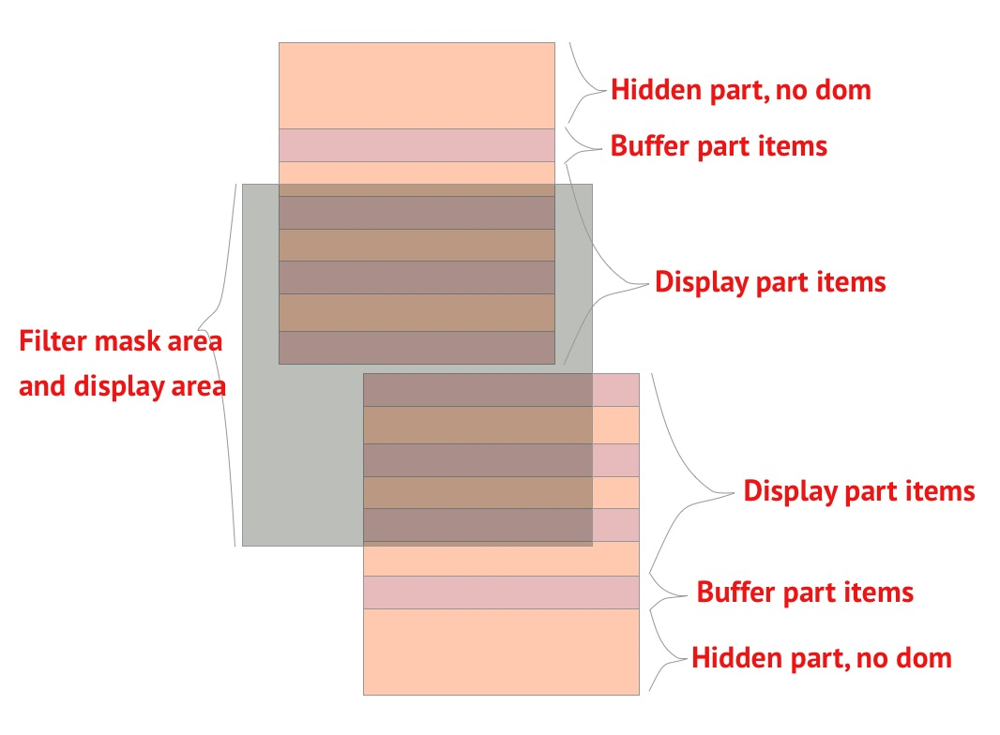

# react-virtualized-mask-list
> Applies to a virtualized list with highly fixed child elements, partial rendering of data within the filter range

!!! This component only applies to fixed lists/tables of row heights.

One VirtualizedMaskFilter can contains multi VirtualizedList.


Install:
```
# use yarn
yarn add react-virtualized-mask-list

# or use npm
npm install react-virtualized-mask-list
```

Usage:
```
/** Filter Usage */
import { VirtualizedMaskFilter } from 'react-virtualized-mask-list';

<VirtualizedMaskFilter>
  {(maskFilterParams) => {
    const { rectRef } = maskFilterParams;
    return (
      <div
        className="listWrapper"
        ref={rectRef}
      >
        <List1 maskFilterParams={maskFilterParams} />
      </div>
    );
  }}
</VirtualizedMaskFilter>

// if scroll container is window, use useWindow prop
<VirtualizedMaskFilter useWindow>
  {(maskFilterParams) => {
    const { rectRef } = maskFilterParams;
    rectRef();

    ...
  }}
</VirtualizedMaskFilter>


/** List Usage */
import { VirtualizedList } from 'react-virtualized-mask-list';

class List1 extends React.Component {
  showRender = (showData) => {
    return (
      <React.Fragment>
        {_.map(showData, (data, index) => {
          ...
        }}
      </React.Fragment>
    );
  };

  noRowsRender = () => null;

  render() {
    const { dataSource, maskFilterParams } = this.props;
    const { top, bottom, stateTs } = maskFilterParams;

    return (
      <div className="list1">
        <VirtualizedList
          maskFilterRectTop={top}
          maskFilterRectBottom={bottom}
          maskFilterStateTs={stateTs}
          data={dataSource}
          rowHeight={32}
          bufferSize={2}
          showRender={this.showRender}
          noRowsRender={this.noRowsRender}
        />
      </div>
    );
  }
}
```
